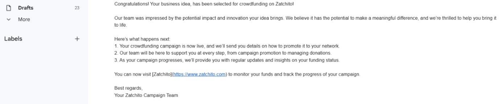

### Figure 1: Login Page  
This page allows registered users to log in using their credentials.  

---

### Figure 2: Register Page for Campaign by Entrepreneur  
Entrepreneurs can sign up and submit details for their crowdfunding campaign.  

---

### Figure 3: Campaign Added Successfully by Entrepreneur  
Confirmation message shown after an entrepreneur successfully submits a campaign.  

---

### Figure 4: List of New Entrepreneur Registrations to Admins  
Admins can view and manage new registration requests from entrepreneurs.  

---

### Figure 5: Entrepreneur Business Proposal Review by Admin  
Admins can view and assess submitted business proposals.  

---

### Figure 6: Entrepreneur Business Image and ID Review by Admin  
Admins verify identity and legitimacy of business through uploaded images and ID.  

---

### Figure 7: Acceptance of Entrepreneur Business Idea  
The admin accepts and approves an entrepreneur’s campaign.  

---

### Figure 8: Acceptance Email to Entrepreneur  
Confirmation email sent to notify the entrepreneur about campaign approval.  

---

### Figure 9: Donation Page to the Crowd  
Public-facing page where donors can contribute to active campaigns.  

---

### Figure 10: Stripe Payment for Donors  
Payment interface powered by Stripe for secure donor transactions.  

---

### Figure 11: Funds Progress Tracking for Each Accepted Business Idea  
Displays real-time progress of funds raised per campaign.  

---

### Figure 12: Stripe Transaction Dashboard for the Crowdfunding  
Admin view of all Stripe transactions related to crowdfunding activities.  

---

### Figure 13: Funds Bar Chart per Entrepreneur  
Visual representation of funds raised by each entrepreneur.  

---

### Figure 14: Project Success Pie Chart for Successful and Failed Crowdfunding  
Breakdown of campaign outcomes: success vs. failure.  

